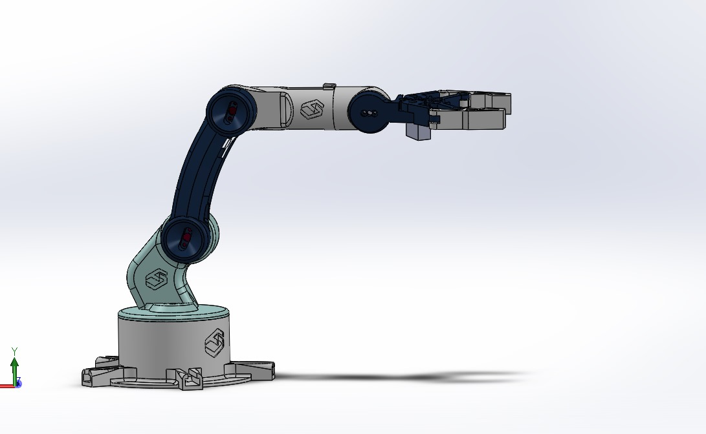

#  4-DOF Robotic Arm Project

##  Project Overview
This project was developed as part of the **Robotics & Cobotics** program at the **EuroMed University of Fez**, within the **Digital Engineering and Artificial Intelligence School (EIDIA)**.  
It focuses on the **design, modeling, and implementation** of a **4-Degree-of-Freedom (DOF) robotic arm**, completed during the **2024–2025 academic year** under the *Conception and Modeling of Robotic Systems* module.

###  Supervised by
- **Prof. Zakaria Chalh**

###  Developed by
- **Mohamed Bofarha**  
- **Omar El Alaoui**  
- **Bouarfa Lahmr**  
- **Hiba Mouhsine**

---

##  Table of Contents
1. [Executive Summary](#executive-summary)  
2. [Introduction](#introduction)  
3. [Mechanical Design](#mechanical-design)  
4. [Kinematics](#kinematics)  
5. [Prototyping and Fabrication](#prototyping-and-fabrication)  
6. [Electronic Architecture and Control](#electronic-architecture-and-control)  
7. [Programming](#programming)  
8. [Simulation](#simulation)  
9. [Constraints and Limitations](#constraints-and-limitations)  
10. [Results and Discussion](#results-and-discussion)  
11. [Conclusion and Future Work](#conclusion-and-future-work)

---

##  Executive Summary
This project presents the **design and implementation** of a **4-DOF robotic arm** capable of performing precise manipulation tasks.  
The main objective was to integrate **mechanical**, **electronic**, and **software** components into a functional robotic system.

### Key Steps
- Theoretical study of **forward and inverse kinematics**.  
- **3D CAD modeling** and **3D printing** for prototyping.  
- **Control system** development using Raspberry Pi 4 and Python.  
- **Simulation and validation** using RViz and Gazebo.  

Despite time and resource constraints, the project successfully demonstrated practical applications of robotics principles and laid the groundwork for **future industrial automation research**.

---

##  Introduction

### Context and Motivation
Automation is a foundation of modern industry. Robotic arms are essential in tasks requiring **precision**, **efficiency**, and **repeatability**.  
This project bridges theoretical robotics knowledge with hands-on engineering experience by designing and implementing a **functional robotic system**.

### Project Objectives
- **Mechanical Design:** Build a robust, modular structure.  
- **Kinematics:** Implement forward and inverse kinematic models.  
- **Prototyping:** Fabricate components using **3D printing**.  
- **Electronic Control:** Develop an embedded control system.  
- **Programming & Simulation:** Validate movements via **Python** and **Gazebo/RViz**.

---

##  Mechanical Design

### Degrees of Freedom (DOF)
The **4-DOF configuration** offers a balance between **precision, complexity, and cost**, suitable for manipulation tasks in academic and industrial applications.

### CAD Modeling
A 3D model was created and adapted using CAD tools to ensure modularity and **3D-printing compatibility**.

  

### Drive Systems
- **MG995 Servomotors** → High-torque joints  
- **MG90 Servomotors** → Lightweight, fast movement joints  

---

##  Kinematics

### Theoretical Kinematics
Forward and inverse kinematics were implemented using the **Denavit–Hartenberg (DH)** convention.

| Joint | θ (theta) | d | a | α (alpha) |
|--------|------------|---|---|-----------|
| 1 | θ₁ | d₁ | a₁ | α₁ |
| 2 | θ₂ | d₂ | a₂ | α₂ |
| 3 | θ₃ | d₃ | a₃ | α₃ |
| 4 | θ₄ | d₄ | a₄ | α₄ |

- **Forward Kinematics:** Used **homogeneous transformation matrices** to compute end-effector pose.  
- **Inverse Kinematics:** Derived analytical solutions to obtain joint angles for desired positions.

---

##  Prototyping and Fabrication

### 3D Printing
All components were printed using **PLA** material and assembled manually.

  

### Assembly
- Integration of **servomotors**, **gears**, and **links**.  
- Proper **cable management** and calibration ensured smooth joint movement.

  

---

##  Electronic Architecture and Control

| Component | Function |
|------------|-----------|
| **Raspberry Pi 4** | Main controller for motion and communication |
| **PCA9685** | 16-channel PWM driver for servomotors |
| **XL4015** | Voltage regulator ensuring stable power |
| **7.4V Li-ion Battery** | Power supply for the entire system |

---

##  Programming

- **Language:** Python  
- **Libraries:**  
  - `RPi.GPIO` → Motor control (PWM)  
  - `Tkinter` → Graphical User Interface for real-time control  

The GUI allows **trajectory planning**, **joint movement control**, and **manual operation**.

---

##  Simulation
Simulations were performed in **RViz** and **Gazebo** to validate the robotic arm’s motion before physical implementation.

  

---

##  Constraints and Limitations

### Constraints
- **Time:** Limited project duration.  
- **Material:** Delays due to component sourcing.  
- **Power Management:** Required voltage regulation.  
- **Learning Curve:** Initial difficulty with Raspberry Pi setup.  
- **Mechanical Alignment:** Calibration required for smooth motion.

### Limitations
- Limited precision due to servo backlash.  
- Restricted real-time performance.  
- Python/OpenCV limitations for heavy computation.  
- Best suited for **indoor/lab environments**.

---

##  Results and Discussion
- Achieved **precise movement** with an average positioning error < **2 cm**.  
- Forward and inverse kinematics validated in both simulation and reality.  
- Some **singularities** caused minor instability in certain configurations.  
- Despite constraints, all **core objectives were achieved**.

---

##  Conclusion and Future Work

### Conclusion
This project successfully demonstrated the design and implementation of a **4-DOF robotic arm**, applying theoretical and practical knowledge from mechanical, electronic, and software domains.

### Future Work
-  **Improved Precision:** Add encoders or torque sensors.  
-  **Intelligent Control:** Integrate AI or ML for path planning.  
-  **Power Management:** Enhance regulation and safety.  
-  **Durability:** Upgrade servos for long-term stability.  

 *For more details, refer to the full project report (French version).*

---

###  Authors
**Mohamed Bofarha**, **Omar El Alaoui**, **Bouarfa Lahmr**, **Hiba Mouhsine**  
 *EuroMed University of Fez — EIDIA, 2024–2025*
